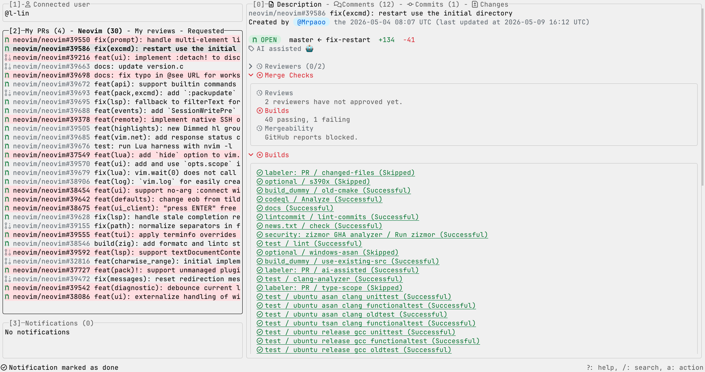
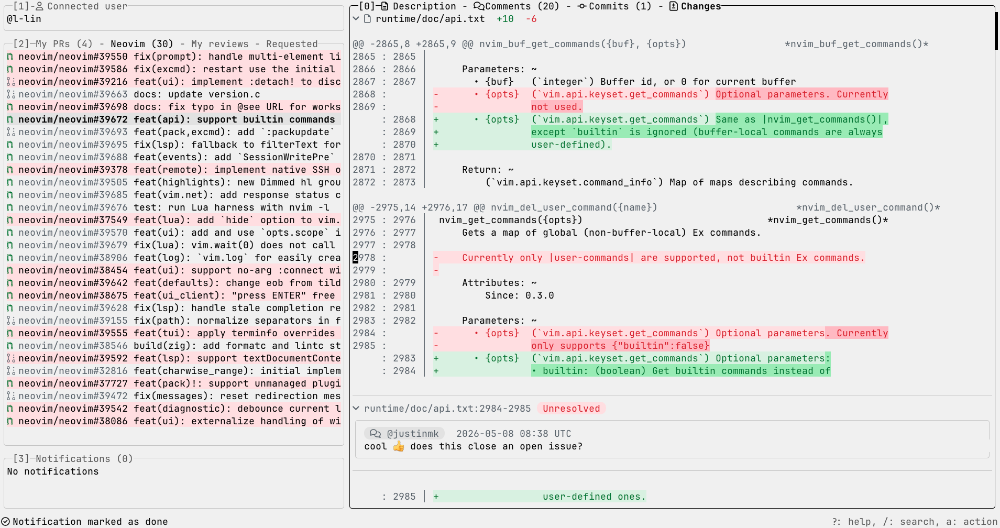
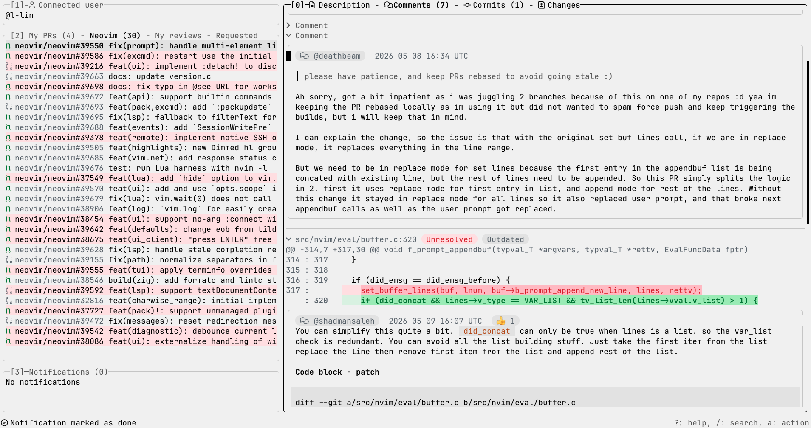
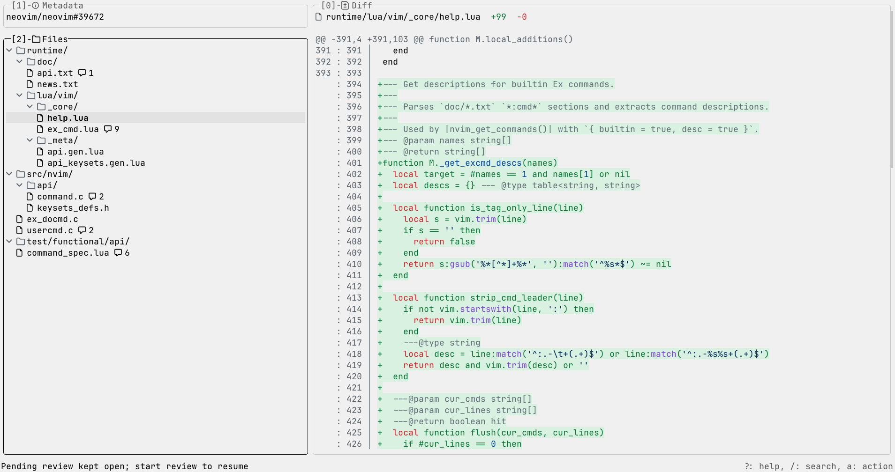
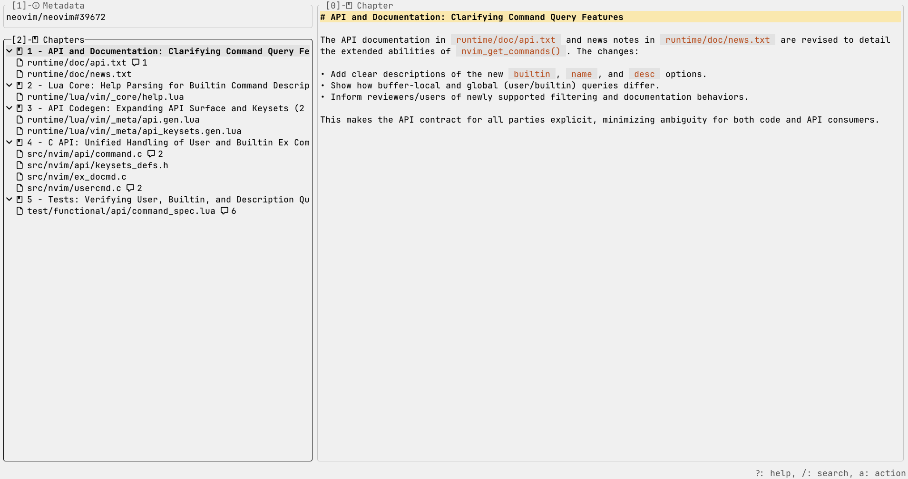
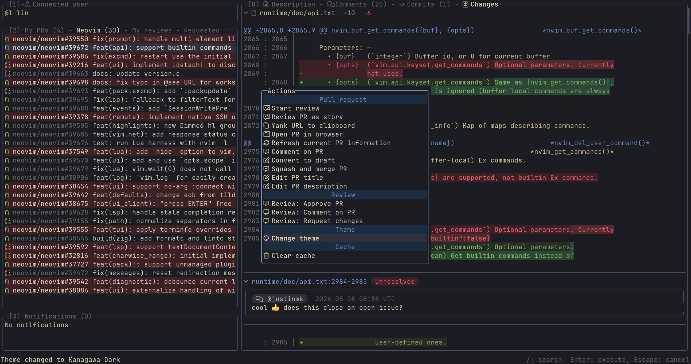

# lazygh

`lazygh` is a Go CLI that aims to make GitHub pull request work less annoying with a lazygit-like TUI.








## Prerequisites

- `mise`
- Go `1.25.9`
- `gh` for the connected user view and the later GitHub-backed milestones

## Installation
### with `mise`

Install `lazygh` globally with `mise`'s Go backend:

```sh
mise use -g go:codeberg.org/l-lin/lazygh/cmd/lazygh@latest
lazygh
```

Run it once without a global install:

```sh
mise exec go:codeberg.org/l-lin/lazygh/cmd/lazygh@latest -- lazygh view https://github.com/acme/widgets/pull/42
mise exec go:codeberg.org/l-lin/lazygh/cmd/lazygh@latest -- lazygh review https://github.com/acme/widgets/pull/42
```

### Run from source

```sh
git clone https://codeberg.org/l-lin/lazygh/cmd/lazygh
mise run run
```

### Install and use from this checkout

```sh
mise run install
mise run lazygh
mise run lazygh view https://github.com/acme/widgets/pull/42
mise run lazygh review https://github.com/acme/widgets/pull/42
```

### Tasks

```sh
mise run run
mise run install
mise run lazygh
mise run test
mise run fmt
mise run tidy
mise run release-check
mise run release-snapshot
```

Open a pull request directly in browser mode with `lazygh view <pr-url>`. Start review mode immediately with `lazygh review <pr-url>`.

### Releases

Tagged pushes that match `v*` publish release archives and `checksums.txt`.
GitHub runs `.github/workflows/release.yml`, Codeberg runs `.forgejo/workflows/release.yml`, and both use `ghcr.io/goreleaser/goreleaser-cross:v1.25.9` to build `linux/amd64`, `linux/arm64`, `darwin/amd64`, `darwin/arm64`, and `windows/amd64`.

Use `mise run release-check` to validate `.goreleaser.yaml`.
Use `mise run release-snapshot` to build the release artifacts locally without publishing them.

## Config

`lazygh` looks for `$XDG_CONFIG_HOME/lazygh/config.toml`. If `XDG_CONFIG_HOME` is unset, it falls back to `~/.config/lazygh/config.toml`.

If the file is missing, `lazygh` starts with the built-in defaults. If the TOML is malformed, startup fails. Unknown scopes, unknown actions, invalid key strings, invalid keymap value types, invalid theme colors, invalid story-review settings, invalid cache settings, and invalid pull-request search entries are ignored, because apparently survival is preferable to drama.

### Cache

`lazygh` uses SQLite as cache storage to improve user experience.
Use `[cache]` to control the persistent SQLite cache.

- By default, `lazygh` stores the cache at `$XDG_DATA_HOME/lazygh/cache.sqlite3`.
- If `XDG_DATA_HOME` is unset, it falls back to `~/.local/share/lazygh/cache.sqlite3`.
- `lazygh` shows cached pull-request lists immediately, then refreshes the active list in the background.
- Cached PR detail and review diff entries refresh only when the live list reports a newer `updatedAt`, or when `lazygh` mutates that PR and invalidates the cached entry.

This example overrides the cache path:

```toml
[cache]
path = "/tmp/lazygh/cache.sqlite3"
```

### Themes

By default, it will use the `system` preset if not set:

```toml
[theme]
preset = "system"
```

Available presets include `system`, `light`, and `dark`, plus the additional presets listed in [`preset.go`](internal/theme/preset.go).

You can switch presets from inside the app too. `Change theme` in the actions popup updates the resolved config file immediately.

You can find the list of palette variables in [palette.go](internal/theme/palette.go).

A few palette entries do more than their names suggest:

- `background` fills the full TUI background.
- `markdown_heading_background` controls the full-line heading fill.

- `pull_request_reference` colors the `owner/repo#123` prefix in pull-request lists.
- `pull_request_title` colors the pull-request title text in pull-request lists.
- `pull_request_status_*_background` also colors the `` status icon in pull-request lists.
- `success_background` and `failure_background` also fill pull-request rows in view 2 when the Merge Checks summary is fully passing or failing.

This example starts from `kanagawa-dark` and overrides a few colors.

```toml
[theme]
preset = "kanagawa-dark"
# Values must use the `#RRGGBB` format.
background = "#1F1F28"
active_border = "#7E9CD8"
inactive_border = "#54546D"
selected_line_background = "#363646"
pull_request_reference = "#656D76"
pull_request_title = "#DCD7BA"
success = "#98BB6C"
success_background = "#2B3328"
failure = "#E46876"
failure_background = "#43242B"
pending = "#C8C093"
pending_background = "#363646"
muted = "#727169"
comment_author_badge = "#7E9CD8"
comment_author_badge_background = "#223249"
markdown_heading = "#7E9CD8"
markdown_heading_background = "#223249"
syntax_keyword = "#957FB8"
syntax_string = "#98BB6C"
pull_request_status_merged = "#957FB8"
pull_request_status_merged_background = "#252535"
diff_addition_highlight_background = "#35513B"
diff_deletion_highlight_background = "#5A2E35"
```

### Links

You can open a link either from the actions popup (default keymap `a`), or by pressing `gx`.

- By default, `lazygh` uses `open` on macOS.
- By default, `lazygh` uses `xdg-open` on Linux.

```toml
[links]
# Example opens links with Firefox on macOS.
# Can be a string or an array of strings. `lazygh` appends the resolved URL as the last argument.
open_command = ["open", "-a", "Firefox"]
```

### Story review

Story review powers `lazygh` story mode. It shells out to an external coding agent and expects the final answer to be JSON only.

Configure `story_review.agent_command` under `[story_review]`. `lazygh` writes the generated prompt to a temporary file and replaces `{{prompt_file}}` in the configured command. If your command does not include `{{prompt_file}}`, `lazygh` appends the prompt file path as the last argument.

A direct `pi` example:

```toml
[story_review]
agent_command = ["pi", "--models", "anthropic/claude-sonnet-4-6", "--no-session", "-p", "@{{prompt_file}}"]
```

If your agent wants prompt text instead of a prompt-file flag, wrap it with `bash -lc` and read the file inside the shell.

```toml
# Claude Code (`claude-code`, or `claude` on some installs)
[story_review]
agent_command = ["bash", "-lc", "claude -p --output-format json \"$(<{{prompt_file}})\""]
```

```toml
# Codex
[story_review]
agent_command = ["bash", "-lc", "codex exec \"$(<{{prompt_file}})\""]
```

```toml
# OpenCode
[story_review]
agent_command = ["bash", "-lc", "opencode run \"$(<{{prompt_file}})\""]
```

By default, `lazygh` uses the prompt in [prompt.go](internal/story/prompt.go).

You can override the prompt too:

```toml
[story_review]
agent_command = ["pi", "--models", "anthropic/claude-sonnet-4-6", "--no-session", "-p", "@{{prompt_file}}"]
prompt = """
Group the changes into a logical, reviewer-friendly story. Use a professional tone. Prefer chapters that reflect one cohesive behavior change, refactor step, or debugging thread. Explain what each chapter is doing, why it exists, and what a reviewer should mentally connect across the listed files. Keep the narrative concise, concrete, and useful for code review.
"""
```

You can find some prompt examples in [`prompts/story-review/`](./prompts/story-review/).

### Pull request searches

You can customize your own pull request searches under `[[pull_requests.searches]]`.

```toml
[[pull_requests.searches]]
label = "My PRs"
command = ["search", "prs", "--author", "@me", "--state", "open", "--sort", "updated", "--order", "desc"]

[[pull_requests.searches]]
label = "My reviews"
command = ["search", "prs", "--reviewed-by", "@me", "--limit", "100", "--state", "open", "--sort", "updated", "--order", "desc"]

[[pull_requests.searches]]
label = "Requested"
command = ["search", "prs", "--review-requested", "@me", "--limit", "100", "--state", "open", "--sort", "updated", "--order", "desc"]

# New search
[[pull_requests.searches]]
label = "Escalated"
command = ["search", "prs", "--search", "label:escalated state:open", "--sort", "updated", "--order", "desc"]
```

### Actions

Press `a` to open the actions popup for the focused view.

`Assign PR` opens a searchable assignee picker. Press `enter` to toggle an assignee, then press `alt+enter` to save. GitHub only allows up to 10 assignees per pull request, and your account still needs permission to assign users in that repository.

### Keymap overrides

Use scoped tables under `[keymaps]`.

A keymap value can be a single key like `"q"` or a two-key sequence like `"za"`. Arrays still let you keep multiple alternatives. The config uses shared behavior-first scopes. `keymaps.global` covers actions that work across multiple panes. `keymaps.global.previous_tab` and `keymaps.global.next_tab` cover tab switches. `keymaps.global.next_side_view` and `keymaps.global.previous_side_view` share both the global and side-pane aliases, so the first binding stays global and later bindings stay side-pane-only. `keymaps.modal_editor.cancel` covers the modal editor. help, detail, and actions popup search reuse shared scopes. `0`, `1`, `2`, and `3` stay fixed.

`full_page_down` and `full_page_up` default to `ctrl-d`/`ctrl-u` in list and detail views. Text inputs keep `ctrl-b` and `ctrl-f` for cursor movement, so their fallback page motions stay on `ctrl-f`/`ctrl-b`.

`zt`, `zz`, and `zb` place the selected row in list views. In detail views, `zt`/`zz`/`zb` place the cursor at the top/center/bottom. Use `za` for inline conversations, and `zM` and `zR` close or open every fold in the current detail context.

`w`, `e`, and `b` follow vim word motions. `W`, `E`, and `B` use whitespace-delimited `WORD` motions.

```toml
[keymaps.selection]
close = ["esc", "q"]
full_page_down = "ctrl-d"
full_page_up = "ctrl-u"
next_side_view = ["tab", "l"]
previous_side_view = ["shift+tab", "h"]

[keymaps.cursor]
move_cursor_left = ["h", "left"]
move_cursor_right = ["l", "right"]
move_cursor_to_next_big_word = "W"
move_cursor_to_big_word_end = "E"
move_cursor_to_previous_big_word = "B"

[keymaps.global]
previous_tab = "["
next_tab = "]"
next_side_view = ["tab", "l"]
previous_side_view = ["shift+tab", "h"]

[keymaps.modal_editor]
cancel = ["esc", "q"]
```

You can find the default keymaps in [default_keymaps.toml](internal/config/default_keymaps.toml)
